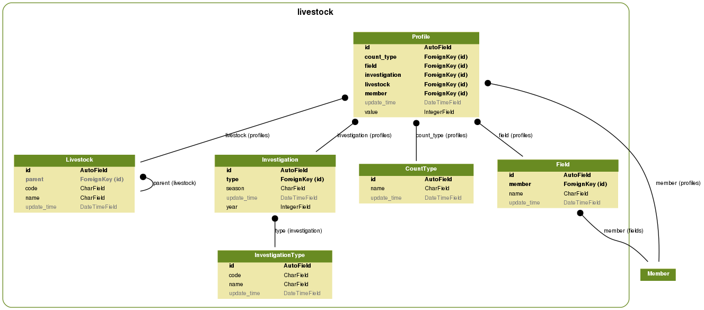

# agri  

## Runtime  
`Python-3.6.5`  

## Requirements  
```
Django==2.0.6
djangorestframework==3.8.2
pytz==2018.5
PyYAML==3.13
```   

## Project initialization  
Trello

## [Graphs](doc/graphs/README.md)

**household**


**welfare**


**smallbig**


**livestock**



**fallow**


**disaster**


